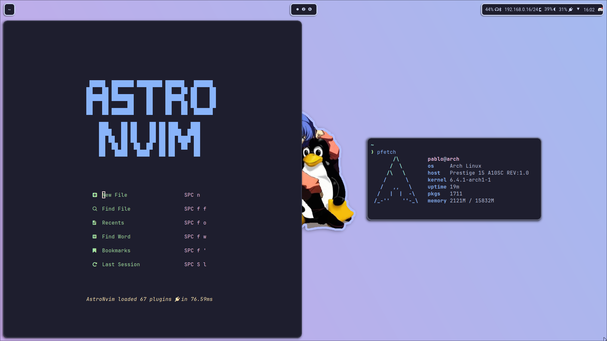
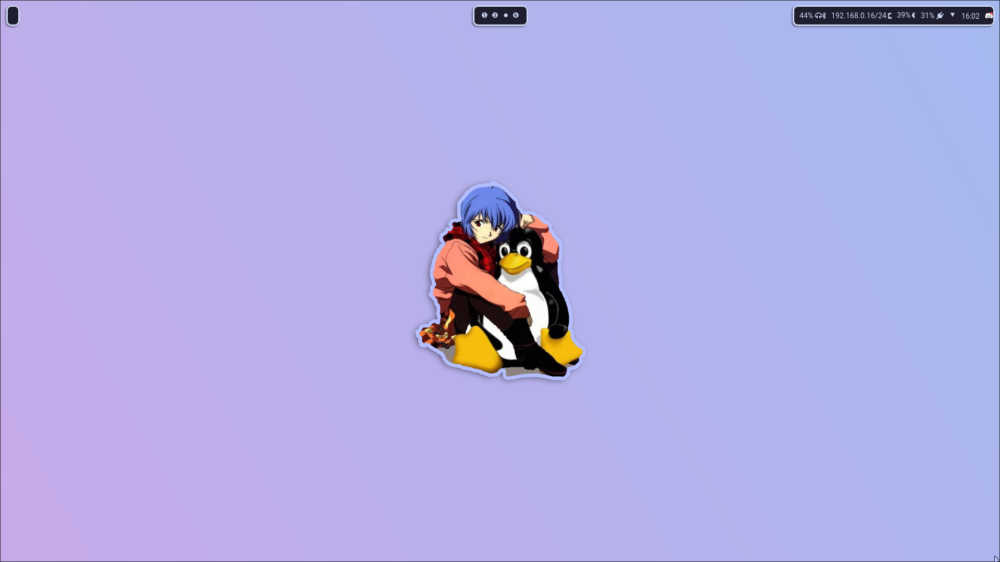
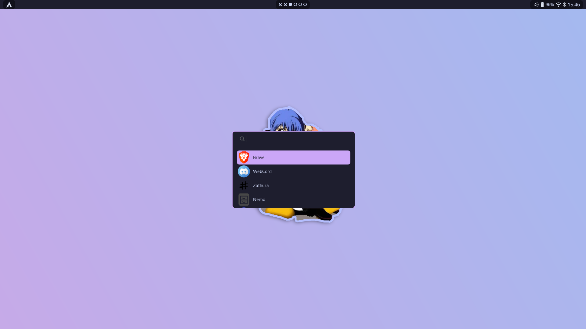

# Dotfiles

*My personnal linux desktop configuration.*

- **OS:** [archlinux](https://archlinux.org) 
- **WM:** [hyprland](https://github.com/hyprwm/Hyprland)
- **Bar:** [waybar](https://github.com/Alexays/Waybar)
- **Control Panel:** [eww](https://github.com/elkowar/eww)
- **Volume/Brightness indicator:** [avizo](https://github.com/misterdanb/avizo)
- **Terminal:** [foot](https://codeberg.org/dnkl/foot)
- **Color Scheme:** [catppuccin](https://github.com/catppuccin/catppuccin)
- **Nvim config:** [astronvim](https://astronvim.com/)

> Please dont use it blindly, there may be things that are only meant to be used on my setup.

## Screenshots

